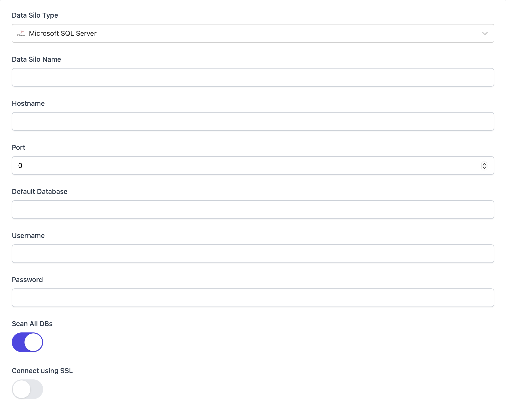

# Microsoft SQL Server

Connecting to Microsoft SQL Server with Monoid works as it does with other MySQL DB's. To do so, navigate to `Data Silos > New Data Silo` from the left-hand sidebar, and select `Microsoft SQL Server` for the Silo type. 

:::caution
If you're connecting to a local instance after running Docker compose, you'll need to replace `localhost` with `host.docker.internal`
:::

Simply enter the connection credentials for the Microsoft SQL Server DB and Monoid will attempt to create a connection. If it succeeds, you will be taken to the newly created Microsoft SQL Server silo's page. 