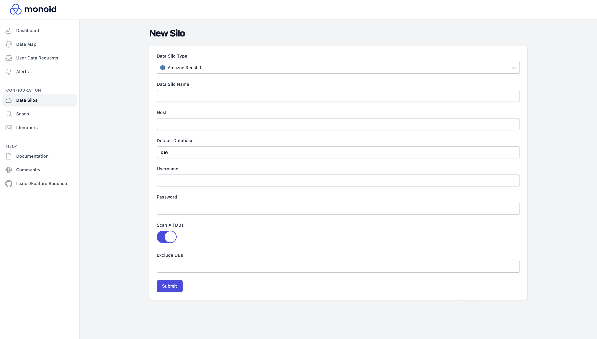

# Amazon Redshift

:::tip

You'll need an active Redshift cluster to connect to Monoid. If you don't have one already, you can create it [here](https://docs.aws.amazon.com/ses/latest/dg/event-publishing-redshift-cluster.html).
:::

:::danger

You'll need to allow connections outside of your Redshift cluster's VPC (if Monoid isn't deployed in the same VPC) or Monoid will not be able to connect. For instructions on how to do so, see [this guide](https://aws.amazon.com/premiumsupport/knowledge-center/redshift-cluster-private-public/).

:::

Connecting to Redshift with Monoid works as it does with most standard tools. To do so, navigate to `Data Silos > New Data Silo` from the left-hand sidebar, and select `Redshift` for the Silo type. Then, fill out the credentials; if correct, Monoid will redirect you to your new silo's page to begin a scan for data sources. 

