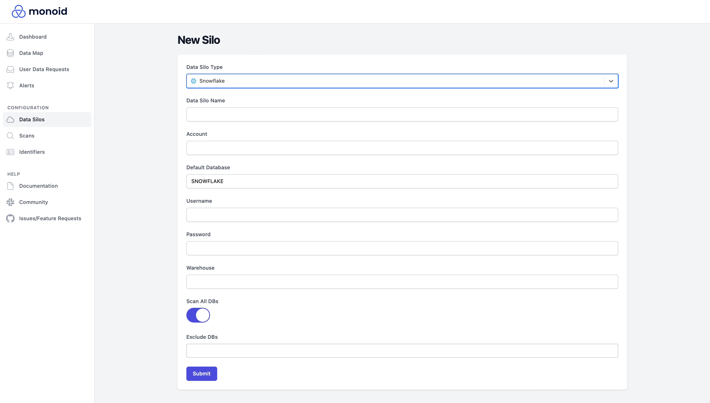
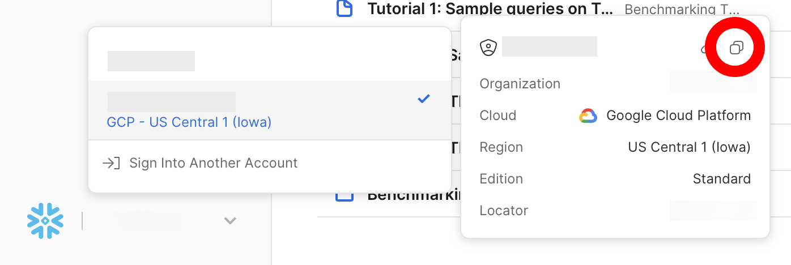

# Snowflake

## Setup 

To provide Monoid with necessary access, you will need an `ACCOUNTADMIN`-role account with `USAGE` privileges on all relevant databases. If you do not have access to this, please contact your Snowflake administrator to set it up for you. 

Furthermore, you will need to indicate a warehouse for Monoid to use. 

## Adding the Silo

Monoid currently supports login authentication for Snowflake. To get your `Account`, go to your Snowflake dashboard, and follow the menus from the bottom left to click on the copy icon shown in the image below; convert your copied account from period-separated to hyphen-separated before pasting (e.g. from `ABCDE.FGHIJ` to `ABCDE-FGHIJ`).

:::tip
If you run into issues, there may be problems around your permissions. Please feel free to [reach out](mailto:jagath@monoid.co) and we'll help you diagnose what's going wrong.
:::