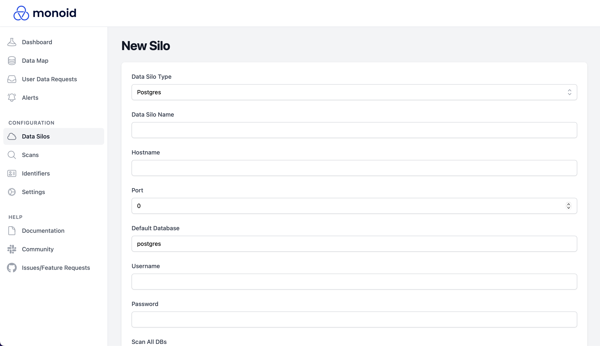

# Connect Data Silos

Monoid's request automations and scanning are built on top of its collection of [open-source pre-built connectors](category/connector-catalog).

## Add a new Silo

1. Navigate to the `Configuration > Data Silos` tab on the left bar.
2. Click on the `New Data
Silo` button on the top-right corner of the screen.
3. Choose from one of the available connectors and follow the [corresponding setup guide](category/connector-catalog/data-silo-guides). Can't find a connector you need? You can [create it yourself](category/build-a-connector), submit an issue on GitHub, or sign up for one of our paid plans to get unlimited on-demand custom connectors.

:::note
The silo creation flow will look different for each type of silo (Postgres is shown above). For silo-specific guides, see the [Connector Catalog](category/connector-catalog).

:::
