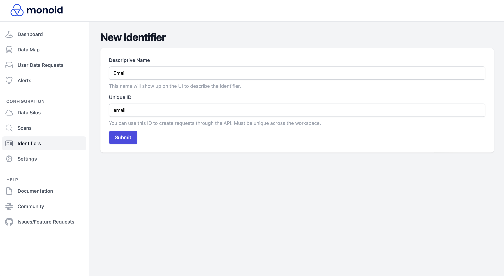

# Create User Identifiers

To automate user data requests, Monoid maintains a single source-of-truth for user identifier types that you can map across each of your silos. Whenever a user data request is submitted, you'll indicate the values for all relevant user identifier types, and Monoid will use those values to find the user in each silo.

To create and manage user identifiers, navigate to `Configuration > Identifiers` on the left sidebar, and click `New Identifier` on the top left corner.

In the opened form, give your identifier a name (e.g. `Email`) and an ID (e.g. `email`). The ID will be used to programmatically generate user data requests via the Monoid API (so if you were deleting users by email, you'd include `email: ...` in the request).

