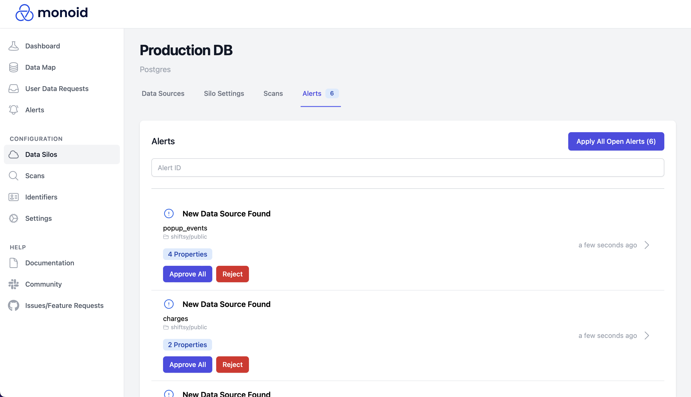
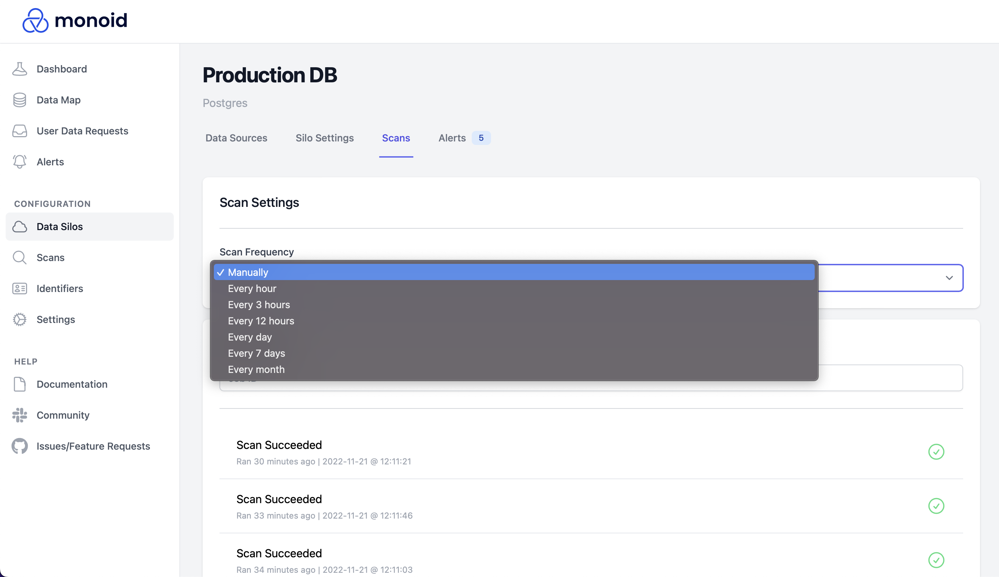

# Scan Data Sources

Once you've connected a data silo, you can scan the silo for its associated data models to create your data map.

To do so, navigate to `Configuration > Data Silos` on the left sidebar, and click on the silo that you want to scan (you'll need to [create the silo](monoid-open-source-quick-start/connect-data-silos.md) first). Then, click the `Scan` button on the top right corner to queue the scan job; based on the silo, the job may take a minute or two to complete.

Once the scan is complete, you'll receive alerts for each detected data source; you can navigate to the `Alerts` tab on the data silo's page (or on the left sidebar) to approve or reject each detected data source.

The data sources you accept, along with their properties, will show up in the `Data Sources` tab of the data silo's page, and can be used to construct your data map.

## Scheduled Scans

Monoid can detect structural changes in connected silos' data sources (e.g. a schema change in a DB table) through scheduled scans. To run scheduled scans, navigate to the `Scans` tab and change the `Scan Frequency` under `Scan Settings`. You can track scheduled scans in the `Scans` tab on the left sidebar or on your silo's page. Scans that detect changes will create alerts on the `Alerts` tab; the changes won't go into effect until you approve the corresponding alerts.

